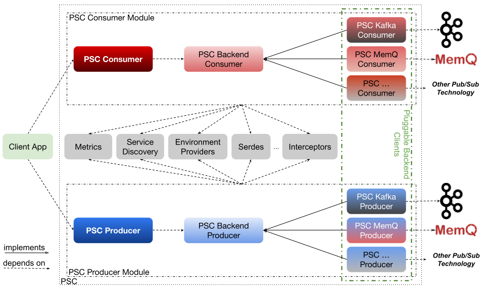

# PubSub Client (PSC)

PubSub Client (PSC) is a generic and extensible client library that allows applications to interact with different backend PubSub systems with a single unified interface. Designed with dev velocity, ease-of-adoption, and flexibility as guiding principles, and having been battle-tested at large scale, PSC is ready to handle production workloads from day one.

## Highlights

Some highlights of PSC include:
- **Hiding PubSub complexities from application developers**: With out-of-the-box features such as optimized configurations and automated service endpoint discovery, application teams can focus on the application logic itself instead of spending precious time debugging client-server connectivity issues. At the same time, platform teams can fully control the clients and client versions that interact with their PubSub servers.

- **Seamlessly switching between different PubSub systems**: With a singular, unified set of APIs for interacting with different PubSub systems, PSC provides the opportunity for client applications to seamlessly switch between PubSubs with zero code change.

- **Automated error handling and remediation**: Built with reducing KTLO burden in mind, PSC is capable of automatically handling common errors and exceptions that occur in the client, all without causing disruption to the client application itself.

- **Unified metrics**: PSC provides a unified set of metrics common to typical PubSub systems and tags them with useful information, allowing for human-friendly visibility into the status of the client

- **Apache Flink support**: PSC comes out-of-the-box with the PSC-Flink connector, allowing [Apache Flink](https://github.com/apache/flink) data streaming jobs to leverage the benefits of PSC.

## Current Status

***PSC is currently under active development.***

PSC currently supports [Apache Kafka](https://github.com/apache/kafka) and [MemQ](https://github.com/pinterest/memq) PubSub systems in Java, with support for more languages and PubSub systems coming soon.

## Compatibility Matrix

Please reference this compatibility matrix to determine which PSC version to adopt:

|               | PSC 2.x  | PSC 3.x  |
| ---           | ---      | ---      |
| Apache Flink  | 1.11.1   | 1.15.1   |         
| Apache Kafka  | 2.3.1    | 2.8.1    |
| MemQ          | 0.2.20   | 0.2.20   |

## Architecture

## Quick Start
Detailed quick start instructions can be found [here](docs/quickstart.md).

## Kafka Client to PSC Migration
Please take a look at this [doc](/docs/nativekafkatopscmigration.md) for more information.

## Blog
Check out the original [PSC blog post](https://medium.com/pinterest-engineering/unified-pubsub-client-at-pinterest-397ccfaf508e) for more details and background!

## Maintainers
- Vahid Hashemian
- Jeff Xiang
- Jesus Zuniga

## Contributors
- Ambud Sharma
- Shardul Jewalikar

## License
PubSub Client is distributed under Apache License, Version 2.0.
